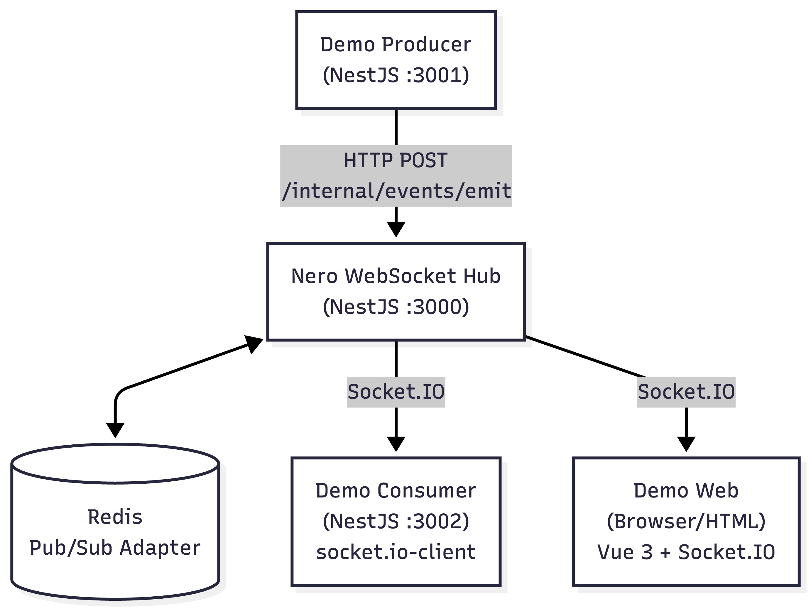
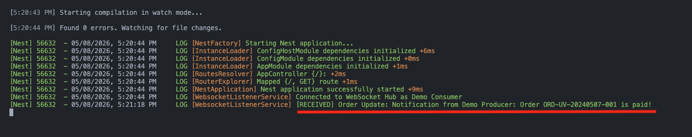
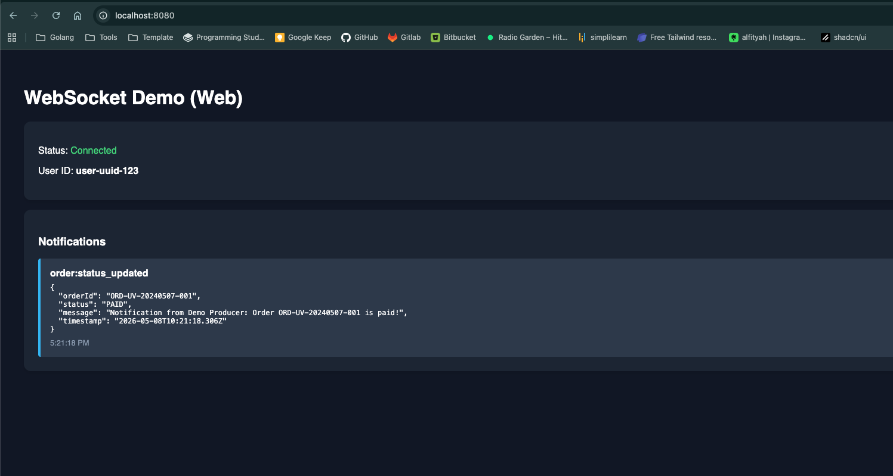

# Explore WebSocket

Project eksplorasi arsitektur **real-time notification** menggunakan WebSocket (Socket.IO) dengan NestJS, Redis Adapter, dan JWT Authentication.

## Arsitektur



## Struktur Project

| Folder           | Deskripsi                                                                                                                                    |
| ---------------- | -------------------------------------------------------------------------------------------------------------------------------------------- |
| `websocket-hub/` | WebSocket Hub utama — menerima event via REST API dan broadcast ke client via Socket.IO. Menggunakan Redis Adapter untuk horizontal scaling. |
| `demo-producer/` | Contoh service backend yang mengirim event ke Hub via HTTP POST (simulasi trigger dari microservice lain).                                   |
| `demo-consumer/` | Contoh service backend yang connect ke Hub sebagai WebSocket client menggunakan `socket.io-client`.                                          |
| `demo-web/`      | Contoh frontend (HTML + Vue 3) yang connect langsung ke Hub via browser WebSocket.                                                           |

## Tech Stack

- **NestJS 11** — Framework backend
- **Socket.IO 4** — WebSocket library
- **Redis** — Pub/Sub adapter untuk Socket.IO (horizontal scaling)
- **JWT** — Autentikasi WebSocket connection
- **Vue 3** — Frontend demo (CDN, tanpa build)
- **Axios** — HTTP client di demo-producer

## Prerequisites

- Node.js >= 18
- Redis server (running & accessible)

## Setup & Menjalankan

### 1. WebSocket Hub

```bash
cd websocket-hub
npm install
cp .env.example .env   # edit sesuai konfigurasi Redis & JWT
npm run start:dev       # berjalan di port 3000
```

**Environment Variables:**

| Variable         | Default     | Deskripsi            |
| ---------------- | ----------- | -------------------- |
| `PORT`           | `3000`      | Port server          |
| `JWT_SECRET`     | -           | Secret key untuk JWT |
| `REDIS_HOST`     | `localhost` | Host Redis           |
| `REDIS_PORT`     | `6379`      | Port Redis           |
| `REDIS_PASSWORD` | -           | Password Redis       |

### 2. Demo Producer

```bash
cd demo-producer
npm install
cp .env.example .env   # set WEBSOCKET_HUB_URL jika beda dari default
npm run start:dev       # berjalan di port 3001
```

Trigger event contoh:

```bash
curl -X POST http://localhost:3001/trigger/order-paid \
  -H "Content-Type: application/json" \
  -d '{"userId": "user-uuid-123", "orderId": "ORD-UV-20240507-001"}'
```

Hasil yang diterima oleh consumer setelah trigger event di atas:

**Demo Consumer (NestJS backend):**



**Demo Consumer (Web browser):**



### 3. Demo Consumer

```bash
cd demo-consumer
npm install
cp .env.example .env   # set WEBSOCKET_HUB_URL jika beda dari default
npm run start:dev       # berjalan di port 3002
```

Consumer akan otomatis connect ke Hub dan listen event `order:status_updated`.

### 4. Demo Web

Pastikan Hub sudah berjalan di `http://localhost:3000`, lalu pilih salah satu cara berikut:

**Cara 1 — Buka langsung di browser:**

Klik dua kali file `demo-web/index.html` atau drag ke browser.

**Cara 2 — Jalankan local HTTP server (recommended):**

```bash
cd demo-web
python3 -m http.server 8080
```

Lalu buka `http://localhost:8080` di browser. Cara ini lebih disarankan untuk menghindari masalah CORS pada beberapa browser.

## Alur Kerja

1. **Hub** start dan connect ke Redis sebagai Pub/Sub adapter
2. **Consumer** (backend/web) connect ke Hub via Socket.IO, join room `user:{userId}`
3. **Producer** mengirim HTTP POST ke Hub endpoint `/internal/events/emit`
4. **Hub** menerima event dan broadcast ke room `user:{userId}` via Socket.IO
5. **Consumer** menerima event secara real-time

## Fitur Utama

- **Redis Adapter** — Mendukung horizontal scaling (multiple instance Hub)
- **JWT Guard** — Autentikasi pada WebSocket connection
- **Room-based routing** — Event dikirim ke user spesifik via room `user:{userId}`
- **Connection State Recovery** — Auto-reconnect dengan recovery hingga 2 menit
- **REST-to-WebSocket bridge** — Microservice lain cukup kirim HTTP POST untuk trigger real-time event
