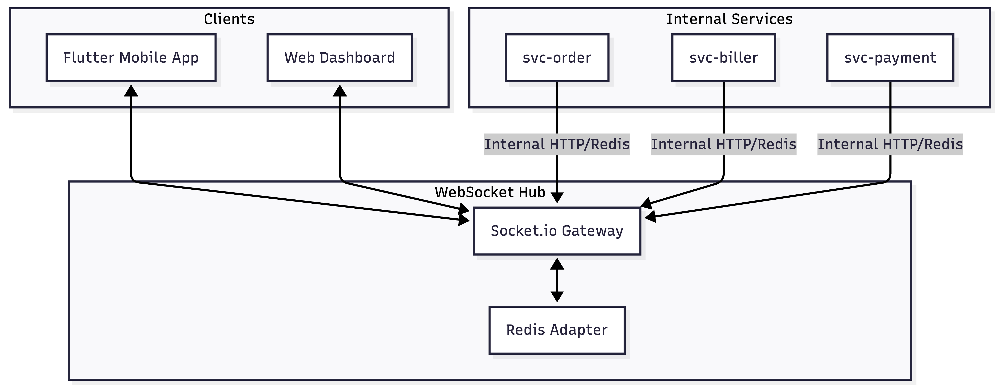
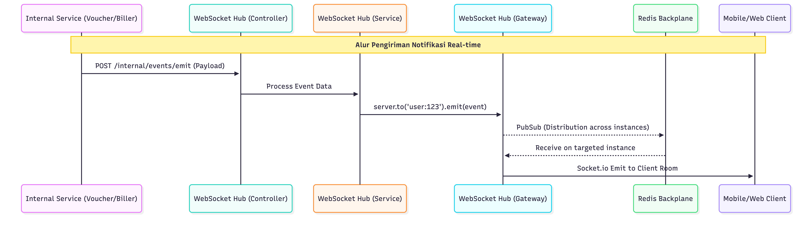

# Technical Design Document: WebSocket Hub

## 1. Overview

`websocket-hub` adalah layanan pusat yang menangani komunikasi real-time di ekosistem. Layanan ini menggantikan peran RabbitMQ untuk pengiriman notifikasi ke aplikasi mobile (Flutter) dan menyediakan jalur komunikasi real-time antar-service.

## 2. Arsitektur Sistem

### 2.1 Tech Stack

- **Framework**: NestJS (Consistency with other services)
- **Engine**: Socket.io (Mature, supports fallback, automatic reconnection)
- **Backplane**: Redis (Scaling & Inter-instance communication)
- **Language**: TypeScript

### 2.2 Diagram Arsitektur



## 3. Flow Komunikasi

### 3.1 Autentikasi & Koneksi

1. Client (Flutter/Web) melakukan koneksi ke WebSocket Hub dengan menyertakan **JWT Token**.
2. Hub memvalidasi token (menggunakan shared secret atau hitting `auth`).
3. Jika valid, client dimasukkan ke dalam **Room** berdasarkan `userId`: `room:user:{userId}`.

### 3.2 Notifikasi ke Mobile (Service to Client)

Flow saat order berhasil:

1. `voucher-order` memproses transaksi hingga sukses.
2. `voucher-order` memanggil internal endpoint di Hub atau mem-publish ke Redis Pub/Sub.
3. Hub menerima pesan tersebut dan melakukan `io.to('room:user:123').emit('order:status_updated', data)`.

### 3.3 Komunikasi Antar-Service (Service to Service)

Untuk menggantikan RabbitMQ dalam koordinasi real-time:

1. Service (misal: `payment`) dapat berperan sebagai "Client" internal.
2. Service melakukan subscribe ke room tertentu (misal: `room:service:payment_events`).
3. Komunikasi terjadi secara dua arah dengan latensi sangat rendah.

## 4. Standar Pesan (Message Schema)

Setiap pesan yang dikirim harus memiliki struktur standar:

```json
{
  "header": {
    "requestId": "uuid-string",
    "timestamp": "2024-05-07T11:00:00Z",
    "sender": "payment"
  },
  "event": "payment:confirmed",
  "target": {
    "type": "USER", // USER atau SERVICE
    "id": "user-uuid-123"
  },
  "payload": {
    "transactionId": "TX-999",
    "amount": 50000,
    "status": "SUCCESS"
  }
}
```

## 5. Strategi Skalabilitas (Redis Adapter)

Untuk menangani ribuan koneksi konkuren, Hub akan dijalankan dalam beberapa instance.

- **Redis Pub/Sub** digunakan agar instance A bisa mengirim pesan ke user yang terkoneksi di instance B.
- Mekanisme ini memastikan _high availability_.

## 6. Penanganan Kegagalan (Reliability)

- **Heartbeat**: Hub secara rutin mengirim ping untuk memastikan client masih aktif.
- **Acknowledgment**: Untuk pesan kritis, pengirim bisa meminta acknowledgment. Jika tidak diterima dalam waktu tertentu, pesan bisa di-_fallback_ ke database atau push notification standar (FCM).

---

## 7. Detail Arsitektur Internal `websocket-hub`

Layanan ini dibangun menggunakan **NestJS** dengan arsitektur yang modular untuk memastikan pemisahan tanggung jawab (_separation of concerns_).

### 7.1 Komponen Utama

- **`EventsGateway`**: Menangani koneksi WebSocket (Socket.io). Bertanggung jawab untuk proses _handshake_, autentikasi melalui Guard, dan manajemen _room_ (user joining room).
- **`EventsService`**: Logika bisnis utama untuk pengiriman pesan. Service ini yang memutuskan apakah pesan dikirim ke user tertentu, grup tertentu, atau disiarkan ke semua client.
- **`EventsController`**: Menyediakan REST API internal. Endpoint ini digunakan oleh service backend lain (Publisher) untuk memicu pengiriman pesan tanpa harus menjaga koneksi WebSocket yang persisten.
- **`WsJwtGuard`**: Middleware keamanan yang memvalidasi setiap upaya koneksi menggunakan JWT.
- **`RedisIoAdapter`**: Menghubungkan Socket.io dengan Redis Pub/Sub agar pesan tetap terdistribusi meskipun Hub memiliki banyak instance.

### 7.2 Sequence Diagram: Pengiriman Notifikasi (Service to Client)



---

## 8. Panduan Implementasi: Publisher (Pengirim)

Publisher adalah service yang memicu kejadian (event). Publisher tidak perlu terkoneksi via WebSocket, cukup melakukan **HTTP POST** ke Hub.

### 8.1 Node.js (NestJS)

```typescript
import axios from "axios";

async function sendNotification(userId: string, message: string) {
  const hubUrl = "http://websocket-hub:3000/internal/events/emit";
  const payload = {
    userId: userId,
    event: "notification:received",
    payload: {
      message: message,
      timestamp: new Date().toISOString(),
    },
  };

  try {
    await axios.post(hubUrl, payload);
  } catch (error) {
    console.error("Failed to send notification to Hub", error.message);
  }
}
```

### 8.2 Node.js (Express)

```javascript
const axios = require("axios");

const triggerEvent = async (userId, data) => {
  try {
    await axios.post("http://hub-url/internal/events/emit", {
      userId: userId,
      event: "order_status",
      payload: data,
    });
  } catch (err) {
    console.error(err);
  }
};
```

### 8.3 Python

```python
import requests

def emit_to_hub(user_id, event_name, data):
    url = "http://hub-url/internal/events/emit"
    payload = {
        "userId": user_id,
        "event": event_name,
        "payload": data
    }
    response = requests.post(url, json=payload)
    return response.json()
```

### 8.4 Go

```go
import (
    "bytes"
    "encoding/json"
    "net/http"
)

func EmitToHub(userId string, event string, payload interface{}) error {
    url := "http://hub-url/internal/events/emit"
    data := map[string]interface{}{
        "userId":  userId,
        "event":   event,
        "payload": payload,
    }
    jsonData, _ := json.Marshal(data)
    _, err := http.Post(url, "application/json", bytes.NewBuffer(jsonData))
    return err
}
```

---

## 9. Panduan Implementasi: Consumer (Penerima)

Consumer adalah aplikasi yang mendengarkan event. Bisa berupa Mobile App, Frontend Web, atau Backend Service lain yang butuh data real-time.

### 9.1 Mobile (Flutter)

Dependency: `socket_io_client`

```dart
import 'package:socket_io_client/socket_io_client.dart' as IO;

void initWebSocket() {
  IO.Socket socket = IO.io('http://hub-url', {
    'transports': ['websocket'],
    'auth': {'token': 'YOUR_JWT_TOKEN'},
    'query': {'userId': 'user-123'}
  });

  socket.onConnect((_) {
    print('Connected to WebSocket Hub');
  });

  socket.on('notification:received', (data) {
    print('New Notification: ${data['message']}');
  });
}
```

### 9.2 Frontend (React)

```javascript
import { useEffect } from "react";
import { io } from "socket.io-client";

const useWebSocket = (userId, token) => {
  useEffect(() => {
    const socket = io("http://hub-url", {
      auth: { token },
      query: { userId },
    });

    socket.on("order_status", (data) => {
      console.log("Order Updated:", data);
    });

    return () => socket.disconnect();
  }, [userId, token]);
};
```

### 9.3 Frontend (Vue 3)

```javascript
import { onMounted, onUnmounted } from "vue";
import { io } from "socket.io-client";

export function useWebSocket(userId, token) {
  const socket = io("http://hub-url", {
    auth: { token },
    query: { userId },
  });

  onMounted(() => {
    socket.on("connect", () => console.log("Connected!"));
  });

  onUnmounted(() => socket.disconnect());

  return { socket };
}
```

### 9.4 Backend Listener (NestJS)

```typescript
import { io, Socket } from "socket.io-client";

@Injectable()
export class WebsocketListenerService implements OnModuleInit {
  private socket: Socket;

  onModuleInit() {
    this.socket = io("http://hub-url", {
      auth: { token: "INTERNAL_SERVICE_TOKEN" },
      query: { userId: "service-account-id" },
    });

    this.socket.on("events", (data) => {
      // Process data
    });
  }
}
```

---

## 10. Implementasi Bahasa Lain (Consumer)

### 10.1 Go (Socket.io Client)

```go
import "github.com/googollee/go-socket.io/client"

// Gunakan library socket.io-client go untuk terhubung
// Contoh menggunakan: github.com/zishang520/socket.io-go-client
```

### 10.2 Java/Kotlin (Android)

```java
IO.Options options = new IO.Options();
options.auth = Collections.singletonMap("token", "JWT_TOKEN");
options.query = "userId=user-123";
Socket socket = IO.socket("http://hub-url", options);
socket.on("event", args -> {
    JSONObject data = (JSONObject) args[0];
});
socket.connect();
```

### 10.3 Rust

```rust
let socket = ClientBuilder::new("http://hub-url")
    .auth(json!({"token": "JWT_TOKEN"}))
    .query(vec![("userId", "user-123")])
    .connect()
    .expect("Connection failed");

socket.on("notification", |payload, _| {
    println!("Received: {:?}", payload);
}).expect("Error setting up listener");
```

---

## 11. Konfigurasi Environment Variables

Berikut adalah referensi variabel lingkungan yang diperlukan untuk menjalankan `websocket-hub`:

| Variabel         | Deskripsi                               | Default     |
| :--------------- | :-------------------------------------- | :---------- |
| `PORT`           | Port layanan WebSocket Hub              | `3000`      |
| `JWT_SECRET`     | Secret key untuk validasi token client  | -           |
| `REDIS_HOST`     | Hostname server Redis                   | `localhost` |
| `REDIS_PORT`     | Port server Redis                       | `6379`      |
| `REDIS_PASSWORD` | Password autentikasi Redis              | -           |
| `CORS_ORIGIN`    | Domain yang diizinkan (comma separated) | `*`         |

---

## 12. Monitoring & Observability

Untuk memastikan kesehatan sistem di produksi, gunakan strategi berikut:

### 12.1 Logging (Grafana/Loki)

Semua log koneksi, diskoneksi, dan error autentikasi harus dikirim ke Loki.

- **Log Event**: `Client Connected`, `Client Disconnected`, `WS Authentication Failed`.
- **Log Data**: Sertakan `userId`, `clientId`, dan `ipAddress`.

### 12.2 Health Check

Endpoint `/health` harus tersedia untuk dipantau oleh Kubernetes/Prometheus.

- Cek status koneksi ke Redis.
- Cek ketersediaan memori (penting untuk aplikasi stateful).

---

## 13. Strategi Error Handling & Reliability

### 13.1 Automatic Reconnection

Client (Mobile/Web) harus dikonfigurasi untuk melakukan reconection otomatis jika koneksi terputus.

```javascript
const socket = io("http://hub-url", {
  reconnection: true,
  reconnectionAttempts: Infinity,
  reconnectionDelay: 1000,
  reconnectionDelayMax: 5000,
});
```

### 13.2 Data Synchronization Fallback

WebSocket tidak menjamin pengiriman pesan saat client offline.

- **Strategi**: Saat client berhasil reconnect (`on('connect')`), aplikasi harus memanggil REST API (misal: `GET /notifications/history`) untuk mengambil data yang terlewat selama masa offline.

---

## 14. Keamanan (Security)

### 14.1 Rate Limiting

Gunakan `ThrottlerGuard` pada internal API `/internal/events/emit` untuk mencegah pengiriman pesan berlebih dari service yang tidak terkendali.

### 14.2 CORS Configuration

Jangan biarkan `origin: '*'` di produksi. Batasi hanya ke domain resmi Company.

### 14.3 Token Expiration Handling

Client harus menangani error `Unauthorized`. Jika token expired, client harus melakukan refresh token via Auth Service lalu menyambungkan kembali WebSocket dengan token baru.

---

## 15. Load Testing (Pengujian Beban)

Gunakan **Artillery** dengan engine Socket.io untuk mensimulasikan ribuan koneksi.

```bash
# Instalasi
npm install -g artillery artillery-engine-socketio

# Run test
artillery run load-test-config.yml
```

target: 5000ms.

---

## 16. Perbandingan & Keuntungan

### 16.1 Perbandingan dengan Project Open Source Lain

| Fitur                 | websocket-hub                  | Centrifugo / Soketi    | Firebase / Pusher      |
| :-------------------- | :----------------------------- | :--------------------- | :--------------------- |
| **Tech Stack**        | NestJS (Node.js)               | Go / PHP (Standalone)  | Managed Service        |
| **Integrasi Service** | Sangat Mudah (Same Tech Stack) | Butuh Adaptor Tambahan | Sulit / Berbayar       |
| **Auth**              | Native JWT                     | Proprietary / Custom   | Proprietary            |
| **Biaya**             | Free (Self-hosted)             | Free (Self-hosted)     | Berbayar (Usage-based) |
| **Kontrol Kode**      | Full Control                   | Terbatas pada Plugin   | Tidak Ada              |

### 16.2 Kenapa menggunakan `websocket-hub`?

1.  **Konsistensi Ekosistem**: Menggunakan NestJS yang sama dengan service lainnya, memudahkan _maintenance_ bagi tim developer yang sudah ada.
2.  **Autentikasi Terpadu**: Langsung mendukung shared secret JWT tanpa perlu sinkronisasi user ke platform pihak ketiga.
3.  **Efisiensi Resource**: Berjalan sebagai microservice ringan yang bisa di-scale secara horizontal menggunakan Redis yang sudah ada di infrastruktur Company.
4.  **Tanpa Biaya Lisensi**: Tidak ada biaya langganan bulanan seiring bertambahnya jumlah koneksi.

---

## 17. Fitur Lanjutan: Connection State Recovery

`websocket-hub` mengaktifkan fitur `connectionStateRecovery` dari Socket.io v4. Fitur ini memungkinkan:

- Client yang terputus sejenak (misal: sinyal HP hilang) untuk menyambung kembali tanpa kehilangan pesan.
- Hub menyimpan buffer pesan sementara yang akan dikirimkan otomatis saat client kembali online.

**Konfigurasi di Server:**

```typescript
@WebSocketGateway({
  connectionStateRecovery: {
    maxDisconnectionDuration: 2 * 60 * 1000, // Simpan state selama 2 menit
    skipMiddlewares: true,
  }
})

```
